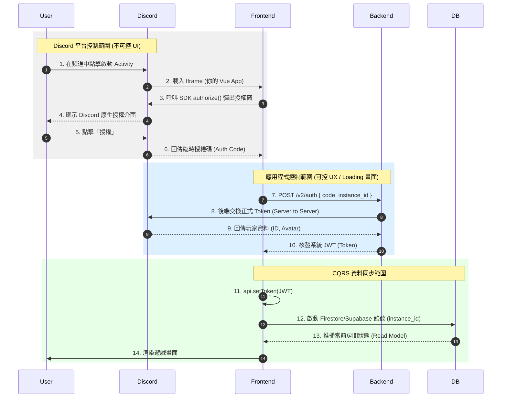

# Milestone #001: 遷移至 Discord Activity

## 概述

將「企鵝搶地」遊戲從獨立網頁版遷移至 Discord Activity，讓玩家可以直接在 Discord 頻道中遊玩。

---

## Discord Activity 驗證與交互流程

以下 Mermaid 圖表展示了從啟動到進入遊戲的完整路徑，並標示了不同的控制範圍：



### 流程說明

| 階段             | 步驟  | 控制權   | 說明                                                       |
| ---------------- | ----- | -------- | ---------------------------------------------------------- |
| Discord 平台控制 | 1-6   | 不可控   | 用戶點擊啟動 → Discord 載入 Iframe → SDK 授權 → 取得授權碼 |
| 應用程式控制     | 7-10  | **可控** | 前端送授權碼給後端 → 後端向 Discord 換 Token → 核發 JWT    |
| CQRS 資料同步    | 11-14 | **可控** | 設定 Token → 監聽即時資料庫 → 推播房間狀態 → 渲染畫面      |

> **關鍵提醒**：在步驟 7 到 10 之間，因為是我們完全可控的範圍，建議在前端實作「預載入」機制。當後端還在驗證 Token 時，前端就開始下載遊戲的地圖與圖片資源，這樣步驟 14 的渲染會快非常多。

---

## 前端工作需求清單

### 1. 平台接入與環境設定 (Infrastructure)

- [ ] **整合 Discord SDK**
  - 完成 SDK 初始化
  - 封裝 `authorize()` 邏輯以取得授權碼

- [ ] **實作 V2 驗證介面**
  - 在步驟 7-10 期間，設計一個優雅的「身分同步中」Loading 畫面

- [ ] **視覺縮放容器 (Scaling)**
  - 針對 Discord 不同裝置（桌面、側邊欄、行動端）開發 AutoResizer 元件
  - 維持地圖長寬比

### 2. 通訊架構與狀態重構 (Architecture)

- [ ] **封裝 Command API**
  - 修改 `src/assets/api.js`，建立發送 Command 的統一入口
  - 規則：Command 請求不再期待返回最新的遊戲數據，僅確認「已接收」

- [ ] **引入即時資料庫監聽**
  - 在 `useGameStore` 建立與 Firestore 或 Supabase 的連線邏輯
  - 狀態替換：將原本由 Action Cable 接收資料的邏輯，重構為從資料庫 Snapshot 更新 Pinia 狀態

- [ ] **樂觀更新 (Optimistic UI)**
  - 調整 `useGame.js` 的預測邏輯
  - 確保玩家操作後 UI 立即反應，不等資料庫回傳

### 3. 遊戲邏輯簡化與座位管理 (UI Logic)

- [ ] **「一頻一房」邏輯實作**
  - 移除大廳路由與房間清單
  - 自動根據 Discord 傳入的 `instance_id` 定位房間

- [ ] **座位系統開發**
  - 實作「入座 / 離座」按鈕與狀態顯示
  - 實作「準備 / 取消」的 Command 發送與 UI 反饋

- [ ] **觀戰者邏輯**
  - 判斷當前 Discord User 是否在 seats 陣列中
  - 若無則鎖定操作權限，僅開放觀察畫面

---

## 現有專案分析

### 技術棧

| 項目       | 現況                                     |
| ---------- | ---------------------------------------- |
| 前端框架   | Vue 3.2.45 (Composition API)             |
| 建置工具   | Vite 4.1.0                               |
| 路由       | Vue Router 4.1.6 (Hash History)          |
| 狀態管理   | Pinia 2.0.33                             |
| 與後端連線 | REST API (Axios) + ActionCable WebSocket |
| 渲染方式   | 純 DOM + CSS（非 Canvas）                |
| 認證       | JWT Token，存於 localStorage             |

### 架構耦合分析

```
┌─────────────────────────────────────────────────────────────┐
│                        View 層                               │
├─────────────────────────────────────────────────────────────┤
│  HomeView.vue          RoomView.vue          GameView.vue   │
│  ┌─────────────┐      ┌─────────────┐      ┌─────────────┐  │
│  │ LobbyChannel│      │ RoomChannel │      │ GameChannel │  │
│  │ .subscribe()│      │ .subscribe()│      │ .subscribe()│  │
│  │ received()  │      │ received()  │      │ received()  │  │
│  │   ↓ 直接    │      │   ↓ 直接    │      │   ↓ 直接    │  │
│  │ 更新 Store  │      │ 更新 Store  │      │ 更新狀態    │  │
│  └─────────────┘      │ .send()     │      │ .send()     │  │
│                       └─────────────┘      └─────────────┘  │
└─────────────────────────────────────────────────────────────┘
                              ↕ 緊密耦合
┌─────────────────────────────────────────────────────────────┐
│                        邏輯層                                │
├─────────────────────────────────────────────────────────────┤
│  useGame.js (遊戲邏輯)     Pinia Stores (狀態)              │
│  ┌─────────────────┐      ┌─────────────────┐               │
│  │ ✅ 純計算邏輯   │      │ user / room     │               │
│  │ pastures        │      │ ✅ 資料存取     │               │
│  │ currentPlayer   │      │                 │               │
│  │ showAllowTarget │      │                 │               │
│  └─────────────────┘      └─────────────────┘               │
└─────────────────────────────────────────────────────────────┘
```

### 解耦程度評估

| 層級         | 狀態      | 說明                              |
| ------------ | --------- | --------------------------------- |
| 遊戲規則邏輯 | ✅ 良好   | `useGame.js` 純計算，不依賴通訊   |
| UI 元件      | ✅ 良好   | `IcePasture.vue` 等純顯示元件     |
| 狀態管理     | ⚠️ 部分   | Store 存資料，但更新散落各處      |
| 通訊層       | ❌ 未解耦 | ActionCable 直接寫在 View 中      |
| 指令發送     | ❌ 未解耦 | `channel.send()` 散落在 View 各處 |

---

## 可行性評估

### ✅ 高可行性

| 項目             | 現有基礎                     | 評估                  |
| ---------------- | ---------------------------- | --------------------- |
| Discord SDK 整合 | 無（純新增）                 | 標準 SDK 整合，無衝突 |
| 認證抽換         | `api.setToken()` 已存在      | Token 來源替換即可    |
| 觀戰者邏輯       | `isObserver` computed 已存在 | 已有判斷邏輯          |
| 視覺縮放基礎     | `pastureScale` 變數已存在    | 已有縮放功能          |

### ⚠️ 中等可行性（需重構）

| 項目            | 影響範圍                 | 工作量   |
| --------------- | ------------------------ | -------- |
| 通訊架構改 CQRS | 三個 View + public store | **最大** |
| 一頻一房        | HomeView + 路由          | 中等     |
| 座位系統        | RoomView                 | 中等     |

### 🔴 風險項目

1. **六邊形網格硬編碼**：`105px` 散落多處，需改為響應式
2. **樂觀更新複雜度**：動畫和狀態更新耦合，需處理 rollback
3. **後端配合**：需要 `/v2/auth` 端點和即時資料庫整合

---

## 建議執行計畫

### 分支策略

採用 **feature branch + 完全取代**，不維護雙軌：

```bash
git checkout -b feature/discord-activity
```

### 執行階段

```
Phase 1: 重構解耦（降低後續風險）
├── 1.1 抽出 Command 層（useRoomCommands, useGameCommands）
├── 1.2 抽出通訊適配器（可抽換 ActionCable / Firestore）
└── 1.3 將事件處理從 View 移至 Composable

Phase 2: 平台接入
├── 2.1 整合 Discord SDK
├── 2.2 實作 V2 驗證流程
└── 2.3 AutoResizer 元件

Phase 3: 簡化遊戲流程
├── 3.1 一頻一房邏輯
└── 3.2 座位系統

Phase 4: 通訊層替換
├── 4.1 引入即時資料庫監聯
└── 4.2 實作樂觀更新機制
```

### 建議重構後的目標架構

```
View 層
  ↓ 呼叫
Command 層（新增）           ← 抽象介面
  ├── useRoomCommands.js    // ready, setCharacter, kick...
  └── useGameCommands.js    // placeStack, moveSheep, splitStack...
  ↓ 實作
通訊適配器（新增）           ← 可抽換
  ├── actionCableAdapter.js // 現有邏輯搬移
  └── firestoreAdapter.js   // 未來實作
```

---

## 待確認事項

- [ ] 後端是否同步開發 `/v2/auth` 端點？
- [ ] 即時資料庫選擇：Firestore 或 Supabase？
- [ ] 是否需要保留原有流程供測試環境使用？
